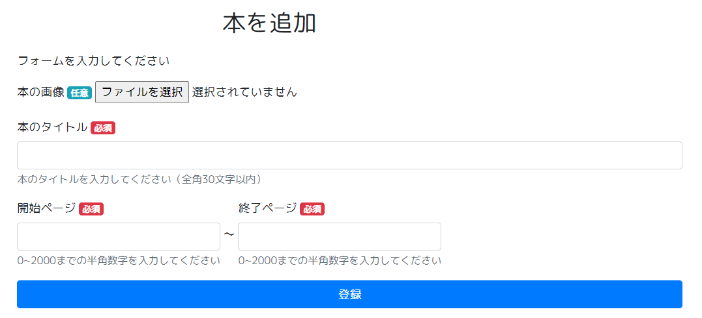
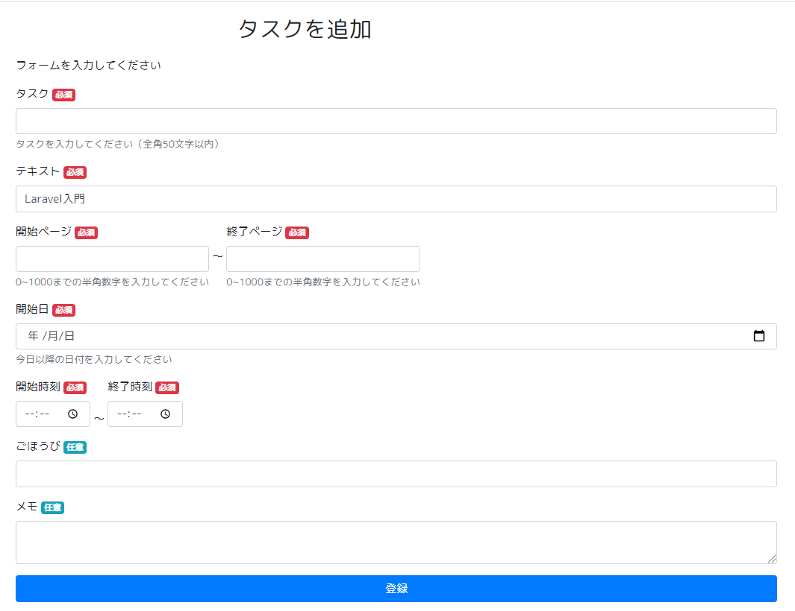
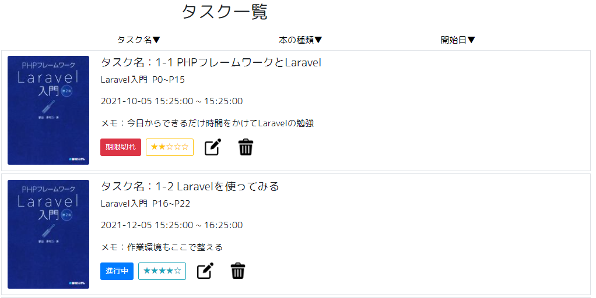
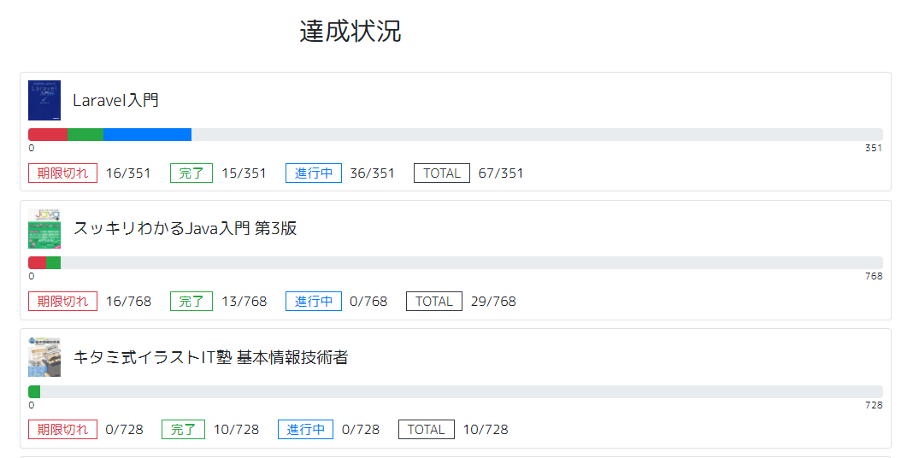
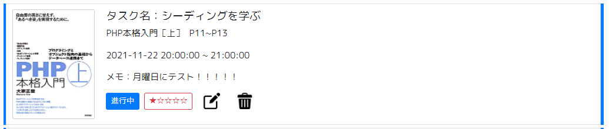
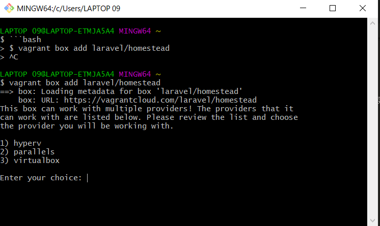
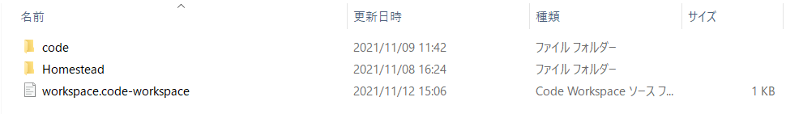

# todoApp-isozumi
<!-- ## Table of content -->
- [Description](#Description)
- [Usage](#usage)
- [Requirement](#Requirement)
- [Installation](#Installation)
- [Note](#Note)
- [Author](#Author)
- [License](#License)


# Description
このアプリは、勉強をするすべての人に対して、テキストを１冊終わらせられるようにサポートをするToDoアプリです。

テキストの【画像、タイトル、開始ページ、終了ページ】を入力すると、タスクでのテキスト名の入力は必要ありません。タスクは、時間単位での入力が可能です。

# Usage

1. [本を登録する](#1.本を登録する)

2. [タスクを登録する](#2.タスクを登録する)

3. [タスク一覧を見る](#3.タスク一覧を見る)

4. [達成度を見る](#4.達成度を見る)

5. [理解度,ステータスを見る](#5.理解度,ステータスを見る)

6. [本を削除する](#6.本を削除する)

7. [タスクを削除する](#7.タスクを更新削除する)

## 1.本を登録する

画像、本のタイトル、開始ページ、終了ページを入力してください。
画像の登録は任意です。

画像を登録しない場合はno imageの画像が自動登録されます。



## 2.タスクを登録する

タスク名、テキスト、開始ページ、終了ページ、開始日、開始時間、終了時間、
ご褒美、メモを入力してください。

ご褒美、メモは任意です。

現在時刻より前になる開始日時は入力できません。



## 3.タスク一覧を見る



## 4.達成度を見る

テキストごとの、達成状況が確認できます。



## 5.理解度,ステータスを見る

タスク更新（完了）時には登録をします。（デフォルトはステータス：進行中、理解度：★☆☆☆☆）


## 6.本を削除する

本棚のごみ箱をクリックすると削除ができます。

※ただし、本を削除すると、該当の本で登録済みのタスクも消えるのでご注意ください。

## 7.タスクを更新削除する

ペンをクリックすると更新、ごみ箱をクリックすると削除できます。



# Requirement
### 環境構築
vagrant https://www.vagrantup.com

VirtualBox https://www.virtualbox.org

Git bash https://gitforwindows.org/

<!-- Homestead laravel/homestead - Vagrant Cloud -->

PHP 8.0.11

Laravel 7.30.4

Bootstrap 4.3.1

jQuery 1.11.3

（windows環境）

# Installation
### 以下の手順で環境構築を行う

1. [vagrant、virtualBox、Git Bashのダウンロードおよびインストール](#1.vagrant,virtualBox,GitBashのダウンロードおよびインストール)

2. [Homestead vagrant boxのダウンロード](#2.Homestead,vagrantboxのダウンロード)

3. [Laravel/Homesteadのダウンロード](#3.Laravel/Homesteadのダウンロード)

4. [Homesteadの設定ファイルの作成](#4.Homesteadの設定ファイルの作成)

5. [SSH鍵の作成](#5.SSH鍵の作成)

6. [Homesteadの設定ファイルの編集](#6.Homesteadの設定ファイルの編集)

7. [仮想マシンの起動](#7.仮想マシンの起動)
 

## 1.vagrant,virtualBox,GitBashのダウンロードおよびインストール

[vagrantのインストール](https://www.vagrantup.com)（最新版）

[VirtualBoxのインストール](https://www.virtualbox.org)（最新版）

[Gitbashのインストール](https://gitforwindows.org)

## 2.Homestead,vagrantboxのダウンロード

Git bashを起動して以下のコマンドを入力し、ダウンロードする

```
$ vagrant box add laravel/homestead
```
<!--  -->

今回のアプリにはvirtualBoxを使用するため、３を入力

## 3.Laravel/Homesteadのダウンロード

Git bash上で、Homesteadをインストールするディレクトリまで移動する

移動したディレクトリで、以下のコマンドを入力

```
$ git clone https://github.com/laravel/homestead.git Homestead
```

ダウンロード完了後、
Homesteadがダウンロードされたディレクトリに、「code」フォルダを作成

<!--  -->

## 4.Homesteadの設定ファイルの作成

※設定ファイル作成は、初めてHomesteadをインストールした場合は必要な作業

Homestead/int.batをダブルクリック

<!--  -->

## 5.SSH鍵の作成
Git bash上で、以下のコマンドを入力

```bash
$ mkdir ~/.ssh && cd $_ #鍵を保存するフォルダを作成 && 移動
$ ssh-keygen -t rsa #鍵作成
```
鍵は、「ユーザー/.ssh/id_rsa」に保存されています。

<!--  -->

## 6.Homesteadの設定ファイルの編集

/Homestead/Homestead.yamlの中の以下を編集
```
folders:
-map: /Homesteadのあるディレクトリ/code
 to: /home/vagrant/code
```

## 7.仮想マシンの起動
Git bash上で、Homesteadフォルダがあるディレクトリまで移動
```
$ cd 'Homesteadまでのパス\Homestead'
```

下記のコマンドを使用して、仮想マシン（vagrant）を起動
```
$ vagrant up
```

起動出来たら、ログインを行う
```
$ vagrant ssh
```

ログインが完了したら、codeディレクトリに移動

# Note

* ネットワークのない環境での動作保証はありません

# Author

Saeka Isozumi

saeka.isozumi@gmail.com

# License

MIT © [SaekaIsozumi](https://github.com/SaekaIsozumi01).


